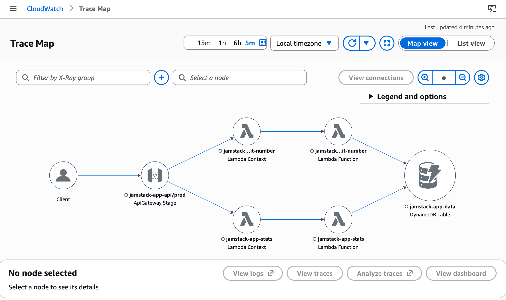

# JAMstack Application Architecture on AWS

## Overview

This architecture implements a JAMstack (JavaScript, APIs, Markup) application
on AWS, providing a scalable, serverless solution where static content and APIs
are accessible from the same domain using different URI patterns.

The main objectives when designing this architecture have been:

1. provide a full working app example with a frontend, data storage, and
   data retrieval and analysis
2. leverage the AWS free tier to create and run the app without incurring any
   costs
3. apply best practices whenever possible, objective 2 entails avoiding some
   services and patterns, this is discussed below

## Key Features

- **Reliable**: Multi-AZ deployment with AWS serverless managed services,
  providing auto-scaling and high availability with minimal operational
  overhead.
- **Secure**: Unified access through CloudFront routing, edge locations
  worldwide cache content close to the user and provide DDoS protection.
  Multi-layer protection for backend services: network isolation, request
  validation, rate limiting, and IAM permissions following the
  [princple of least privilege](https://en.wikipedia.org/wiki/Principle_of_least_privilege)
  .
- **Auditable**: Log forwarding and retention for all system components, X-ray
  tracing enabling tracking user initiated request across services.
- **Automated**: linting and quality checks on the developer's machine and on
  the repo using `pre-commit`, unit tests leveraging moto to mock AWS objects,
  automated IaC deployment using OIDC trust relationship.
- **Cost efficient**: Pay-per-use pricing model for all services, with
  budget notifications for ongoing cost control.

## Architecture Components

### Frontend Layer

- **Amazon CloudFront**: [CDN](https://aws.amazon.com/cloudfront/) for global
  content delivery and request routing, [AWS WAF](https://aws.amazon.com/waf/)
  is not available from the free tier but should be in place for a production-
  ready architecture.
- **Amazon S3**: Very cost efficient storage to host static assets (HTML, CSS,
  JavaScript bundles). Versioning is enabled as it protects against accidental
  deletions and malicious modifications.

### API Layer

- **Amazon API Gateway**: manages the RESTful API endpoints under `/api/*`
  path. Rate limiting is in place to prevent abuse and protect the Lambda
  functions.
- **AWS Lambda**: Serverless functions for JSON payload processing, Lambda
  was used for simplicity, on a real app the compute could be replaced for
  another pay-as-you-go resource like ECS Fargate. The `arm64` architecture
  is used, which means the compute will run on
  [AWS Graviton](https://aws.amazon.com/ec2/graviton/) for cost efficiency.

### Data Layer

- **Amazon DynamoDB**: NoSQL database for JSON data storage. For the example
  use-case we would ideally would use Timestream which is designed for
  time-series workloads, but its free tier is only available for 30 days.
  Using DynamoDB has the downside of the caller code needing to aggregate the
  data when doing a range query.
- **~~DynamoDB Point-in-Time Recovery (PITR)~~** is not included in the AWS
  Free Tier and incurs additional charges so it's not part of the
  architecture. Possible alternatives would be manually creating backups
  or automating on a schedule using EventBridge + Lambda. No other component
  needs backups as everything else can be restored from source.

### Management Layer

- **Amazon CloudFormation**: native AWS Infrastructure as Code (IaC) that is
  used to provision and manage the necessary resources. This project's
  template supports multiple environments in the same AWS account. Deployment
  can be done locally or through GitHub using an OIDC trust relationship.
- **Amazon S3**: the logs for the Frontend Layer are delivered to
  a "logs" S3 bucket. Retention is handled using a lifecycle policy
  and the period can be configured thorough a parameter.
  Typically in a production system these events will be forwarded to a
  [SIEM](https://en.wikipedia.org/wiki/Security_information_and_event_management)
  system.
- **Amazon CloudWatch**: applicationlevel logs that need real-time monitoring
  (API Gateway and Lambda) are delivered to Cloudwatch.
  The log retention period is defined by a CloudFormation parameter.
- **Amazon X-Ray**: traces user requests from end-to-end. It visualizes
  request path via service maps, identifies performance bottlenecks,
  and troubleshoots errors.
  [X-Ray](https://docs.aws.amazon.com/xray/latest/devguide/aws-xray.html)
  supports automatic instrumentation for
  Java, Node.js, Python, and .NET, with seamless integration for AWS
  Lambda, ECS, and API Gateway. X-Ray can be enabled within free tier
  limits.
  X-Ray trace retention is fixed at 30 days, and AWS doesn't allow to
  configure it. It would be possible to export this info, but out of
  scope for this project.
- **AWS Budgets**: a cost management tool to plan and monitor cloud costs.
  The example budget tracks resource consumption per environment, and will
  trigger an email notification if the budget threshold is exceeded,
  the email recipient is configurable.

## Request Flow

1. **Static Content**: `/` → CloudFront → S3
1. **API Requests**: `/api/*` → CloudFront → API Gateway → Lambda → DynamoDB
   1. `POST /api/submit-number`, handled by the `SubmitNumberFunction` Lambda,
      accepts a paylod that is persisted in DynamoDB.
   1. `GET /api/daily-stats`, handled by the `DailyStatsFunction` Lambda,
      scans DynamoDB for a date range and returns statistics.

Review the
[Trace Map](https://docs.aws.amazon.com/xray/latest/devguide/xray-console-servicemap.html)
to better understand the information flow between layers.

