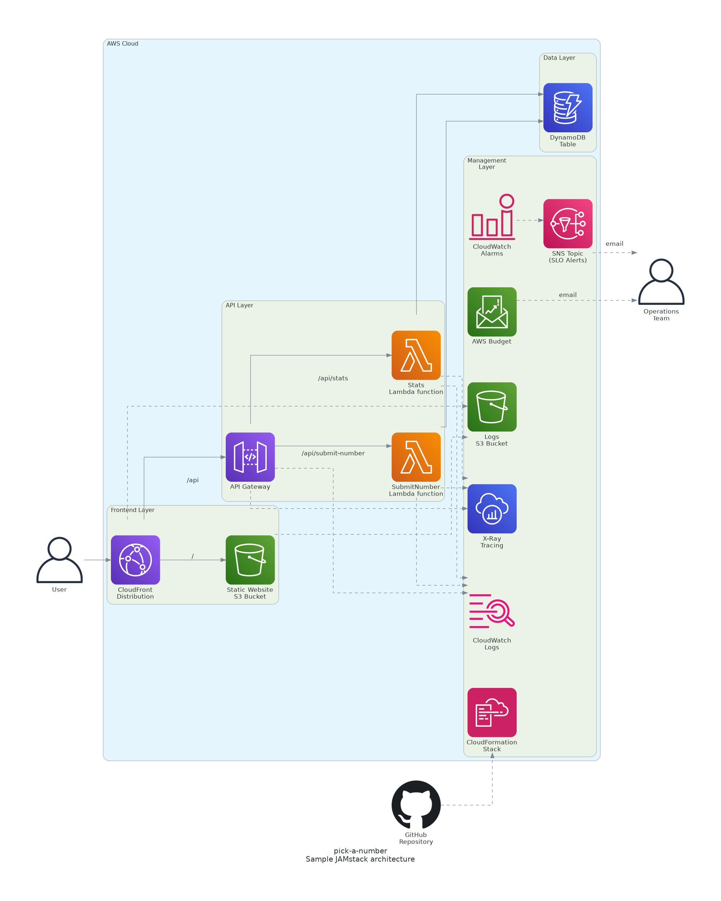

# JAMstack Application Architecture on AWS

## Overview

This architecture implements a JAMstack (JavaScript, APIs, Markup) application
on AWS, providing a scalable, serverless solution where static content and APIs
are accessible from the same domain using different URI patterns.

The two main objectives when designing this architecture have been:

- provide a full working system with a frontend, data storage, and
  data retrieval and analysis
- leverage the AWS free tier to create and run the app without inferring any
  costs

## Architecture Components

### Frontend Layer

- **Amazon CloudFront**: CDN for global content delivery and request routing.
- **Amazon S3**: Hosts static assets (HTML, CSS, JavaScript bundles). A very
  cost effective way to host static files.

### API Layer

- **Amazon API Gateway**: manages the RESTful API endpoints under `/api/*`
  path.
- **AWS Lambda**: Serverless functions for JSON payload processing.

### Data Layer

- **Amazon DynamoDB**: NoSQL database for JSON data storage. Ideally we would
  use Timestream which is designed for time-series workloads, but its free tier
  is only available for 30 days. Using DynamoDB has the downside of the
  caller code needing to aggregate the data.

## Request Flow

1. **Static Content**: `/` → CloudFront → S3
1. **API Requests**: `/api/*` → CloudFront → API Gateway → Lambda → DynamoDB
   1. `POST /api/submit-number`, handled by the `SubmitNumberFunction` Lambda,
      accepts a paylod that is persisted in DynamoDB.
   1. `GET /api/daily-stats`, handled by the `DailyStatsFunction` Lambda,
      scans DynamoDB for a date range and returns statistics.

## Key Features

- **Single Domain**: Unified access through CloudFront routing
- **Serverless**: Minimal operational overhead and Multi-AZ deployment with AWS
  managed services
- **Auto-scaling**: Handles traffic spikes automatically
- **Global CDN**: CloudFront edge locations worldwide cache content close
  to the user and provide DDoS protection
- **Reliability**: Multi-AZ deployment with AWS managed services
- **FinOps optimized**: Pay-per-use pricing model and budget notifications
